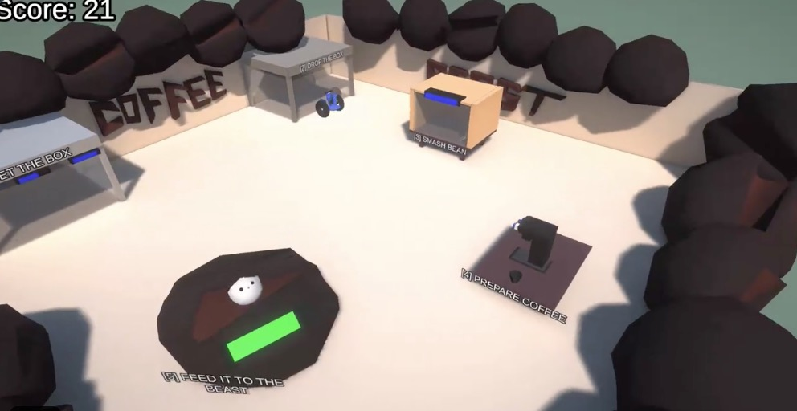

# Coffee-Beast
Game entry for the LDJAM-46 Game Jam.

# Rules
Complete a game in 48h time based on the theme - Keep it alive.

# Game Idea
You have to feed a little coffee beast with a lot of coffee to keep it alive.

There are 5 steps for preparing a coffee:
[1] Take a box of coffee beans
[2] Move the box into another area to reveal the beans
[3] Take the beans and smash them inside the smashing box
[4] Go to the coffee machine and prepare coffee
[5] Finally bring the coffee to the coffee beast.

# Final
All the 3d assets were made using Blender and the entire game was made using Unity.

Due to the time constraints the code is very brute forced into these 5 steps. 
In the last minutes I had to make some very rough and ugly code decisions for the sake of having something playable.
